# EcoChain - Environmental Data Oracle

A comprehensive environmental data oracle and prediction market platform built with hybrid blockchain architecture (Sui + Ethereum). EcoChain provides verifiable environmental monitoring through DePIN (Decentralized Physical Infrastructure) networks, featuring real-time sensor data visualization, blockchain-based sensor management, environmental prediction markets, and AI-powered data analysis.

## 🚀 Quick Start

1. **Clone the repository**
   ```bash
   git clone https://github.com/ryanlau1220/DevMatch-EcoChain.git
   cd DevMatch-EcoChain
   ```

2. **Install dependencies**
   ```bash
   npm install
   ```

3. **Configure environment variables**
   Create a `.env` file in the root directory and copy values from `.env.example`:
   ```env
   VITE_OPENWEATHER_API_KEY=your_openweather_api_key
   VITE_IQAIR_API_KEY=your_iqair_api_key
   VITE_GOOGLE_CLIENT_ID=your_google_client_id
   VITE_FACEBOOK_CLIENT_ID=your_facebook_client_id
   VITE_TWITCH_CLIENT_ID=your_twitch_client_id
   VITE_APPLE_CLIENT_ID=your_apple_client_id
   VITE_GEMINI_API_KEY=your_gemini_api_key
   VITE_SUI_PACKAGE_ID=0x5bbfeb3847bbea0aad7383da8a6ed826c36a031586858ea8287159cfc85d9105
   VITE_SUI_REGISTRY_ID=0xa69b46162707233562a70c0565f74513a7a1bf73f54f745d007d6bd0d108a15e
   VITE_SUI_NETWORK=testnet
   ```

4. **Start development server**
   ```bash
   npm run dev
   ```

5. **Open your browser**
   Navigate to `http://localhost:5173` (or the port shown in terminal)

## 🎯 Project Overview

EcoChain is a decentralized physical infrastructure (DePIN) network for verifiable environmental data, integrating multiple blockchain technologies to create a comprehensive environmental monitoring solution.

### Tracks Integrated
- **Sui (Core Platform)**: Object-centric model for managing virtual sensors as NFTs
- **Oasis Protocol (Trust Layer)**: Confidential smart contract execution and ROFL for off-chain computation
- **Blockchain for Good Alliance**: Addresses UN SDGs 11 and 13
- **The Graph**: Track 1 - Data accessibility through Subgraph indexing
- **Ethereum Foundation**: Track 2 - Best App Built Using Scaffold-ETH 2 for rapid Ethereum dapp development
- **Ethereum Foundation**: Track 3 - Best Tooling for Prediction Markets Built on Ethereum for environmental prediction markets
- **ChatAndBuild**: AI Agent for natural language querying

## 🏗️ Technology Stack

### Programming Languages, Frameworks & Libraries

```mermaid
---
config:
  layout: dagre
---
flowchart TD

    %% Frontend Layer
    UI[🌐 Frontend Interface
    *React 18, TypeScript, Tailwind CSS*
    <u>Multi-page responsive web app</u>
    **Dashboard, Blockchain Management, Prediction Markets, AI Chat**]

    %% Build Tools
    BUILD[⚡ Build System
    *Vite, ESLint, PostCSS*
    <u>Fast development & production builds</u>
    **Hot reload, TypeScript compilation, CSS processing**]

    %% State Management
    STATE[🔄 State Management
    *React Context, Custom Hooks*
    <u>Global state & authentication</u>
    **useAuth, useEnvironmentalData**]

    %% Styling
    STYLING[🎨 Styling & Icons
    *Tailwind CSS, React Icons*
    <u>Utility-first CSS with glassmorphism</u>
    **Responsive design, modern UI components**]

    %% Data Visualization
    CHARTS[📊 Data Visualization
    *Recharts, Chart.js*
    <u>Interactive charts & analytics</u>
    **Real-time data, trend analysis**]

    %% Styling
    classDef frontend fill:#e1f5fe,stroke:#01579b,stroke-width:2px
    classDef build fill:#f3e5f5,stroke:#4a148c,stroke-width:2px
    classDef state fill:#e8f5e8,stroke:#1b5e20,stroke-width:2px
    classDef styling fill:#fff3e0,stroke:#e65100,stroke-width:2px
    classDef charts fill:#fce4ec,stroke:#880e4f,stroke-width:2px

    class UI,STATE,STYLING,CHARTS frontend
    class BUILD build
```


### API Integration, Tracks & Other Tools

```mermaid
---
config:
  layout: dagre
---
flowchart TD

    %% Blockchain Integration
    SUI[🔗 Sui Blockchain
    *Sui SDK, zkLogin*
    <u>Smart contracts & NFT management</u>
    **Sensor NFTs, ownership transfer, trust scores**]

    ETHEREUM[⚡ Ethereum Network
    *Scaffold-ETH 2, Hardhat*
    <u>Prediction markets & oracle bridge</u>
    **Environmental markets, cross-chain data**]

    %% Oracle & Data
    ORACLE[🔮 Oracle Infrastructure
    *Oasis ROFL, The Graph*
    <u>Data verification & indexing</u>
    **Environmental data, subgraph queries**]

    %% AI Integration
    AI[🤖 AI Services
    *Google Gemini API, Mock Mode*
    <u>Natural language processing</u>
    **Environmental queries, intelligent responses**]

    %% Data Sources
    DATA[📊 Environmental APIs
    *OpenWeather, IQAir*
    <u>Real-time environmental data</u>
    **Weather, air quality, temperature**]

    %% Authentication
    OAUTH[🔐 Authentication
    *OAuth2 Providers*
    <u>Multi-provider login system</u>
    **Google, Facebook, Twitch, Apple**]

    %% Smart Contracts
    CONTRACTS[📜 Smart Contracts
    *Move, Solidity*
    <u>Blockchain logic & automation</u>
    **Sui NFTs, Ethereum markets, Oracle bridge**]

    %% Development Tools
    DEVTOOLS[🛠️ Development Tools
    *TypeScript, Node.js, npm*
    <u>Development environment</u>
    **Type safety, package management, build tools**]

    %% Styling
    classDef blockchain fill:#e1f5fe,stroke:#01579b,stroke-width:2px
    classDef oracle fill:#f3e5f5,stroke:#4a148c,stroke-width:2px
    classDef ai fill:#e8f5e8,stroke:#1b5e20,stroke-width:2px
    classDef data fill:#fff3e0,stroke:#e65100,stroke-width:2px
    classDef auth fill:#fce4ec,stroke:#880e4f,stroke-width:2px
    classDef contracts fill:#e8f5e8,stroke:#2e7d32,stroke-width:2px
    classDef tools fill:#f3e5f5,stroke:#7b1fa2,stroke-width:2px

    class SUI,ETHEREUM blockchain
    class ORACLE oracle
    class AI ai
    class DATA data
    class OAUTH auth
    class CONTRACTS contracts
    class DEVTOOLS tools
```


## ✨ Features

### Core Features
- **Real-time Environmental Dashboard**: Live monitoring of air quality, temperature, humidity, and water quality with interactive charts
- **Sui Blockchain Integration**: Virtual sensor management as NFTs with ownership transfer and trust score system
- **Environmental Prediction Markets**: Create and trade on environmental outcome predictions with real-time pricing
- **AI Agent Chat**: Natural language interface for environmental data queries with Google Gemini API integration
- **Cross-chain Oracle Bridge**: Submit environmental data from Sui to Ethereum with verification workflow
- **Real-time Blockchain Data Hub**: Live environmental data from The Graph subgraph with interactive visualizations

### Advanced Features
- **Multi-Provider Authentication**: OAuth2 integration with Google, Facebook, Twitch, and Apple
- **Progressive Web App (PWA)**: Offline-capable web application with responsive design
- **Glassmorphism UI Design**: Modern glass-like interface with backdrop blur effects
- **Data Persistence**: Local storage integration for user preferences and session data
- **Error Boundaries**: Robust error handling with graceful fallbacks
- **Mobile-First Responsive Design**: Optimized for all device sizes

## 🎮 How to Use

### Dashboard
- View real-time environmental data statistics
- Explore interactive charts and visualizations
- Monitor system status and performance metrics
- See live vs simulated data status

### Sui Blockchain Management
1. **Overview Tab**: Check network status, registry stats, and recent activity
2. **My Sensors Tab**: View all owned sensors with detailed information
3. **Register Tab**: Add new sensors to the blockchain
4. **Transfer Tab**: Transfer sensor ownership to other addresses
5. **Trust Scores Tab**: Update sensor trust scores with visual feedback

### Prediction Markets
1. **Create Markets**: Set up new environmental prediction markets
2. **Trade Shares**: Buy and sell YES/NO shares with real-time pricing
3. **View Analytics**: Monitor market statistics and price history
4. **Manage Positions**: Track your trading positions across all markets

### Oracle Bridge
1. **Submit Data**: Add environmental data from Sui sensors
2. **Register Oracles**: Join the oracle network for data verification
3. **Verify Data**: Validate and approve submitted environmental data
4. **Monitor Bridge**: Track cross-chain data flow and network status

### AI Agent Chat
1. **Ask Questions**: Use natural language to query environmental data
2. **Quick Actions**: Use pre-built queries for common environmental topics
3. **View Responses**: Get beautifully formatted AI responses with markdown
4. **Follow Suggestions**: Click on AI-generated follow-up questions

### Blockchain Data Hub
1. **View Live Data**: See real-time environmental data from blockchain
2. **Interactive Charts**: Explore temperature, humidity, and AQI trends
3. **Data Table**: Browse all environmental records with timestamps
4. **Auto-refresh**: Toggle automatic data updates on/off

## 🔧 Configuration

### Environment Variables
Create a `.env` file in the root directory and copy values from `.env.example`:

```env
# Environmental Data APIs
VITE_OPENWEATHER_API_KEY=your_openweather_api_key
VITE_IQAIR_API_KEY=your_iqair_api_key

# OAuth Configuration
VITE_GOOGLE_CLIENT_ID=your_google_client_id
VITE_FACEBOOK_CLIENT_ID=your_facebook_client_id
VITE_TWITCH_CLIENT_ID=your_twitch_client_id
VITE_APPLE_CLIENT_ID=your_apple_client_id

# AI Integration
VITE_GEMINI_API_KEY=your_gemini_api_key

# Sui Blockchain Configuration
VITE_SUI_PACKAGE_ID=0x5bbfeb3847bbea0aad7383da8a6ed826c36a031586858ea8287159cfc85d9105
VITE_SUI_REGISTRY_ID=0xa69b46162707233562a70c0565f74513a7a1bf73f54f745d007d6bd0d108a15e
VITE_SUI_NETWORK=testnet
```

### API Setup
1. **OpenWeather API**: Get API key from [OpenWeatherMap](https://openweathermap.org/api)
2. **IQAir API**: Get API key from [IQAir](https://www.iqair.com/air-pollution-data-api)
3. **Gemini API**: Get API key from [Google AI Studio](https://makersuite.google.com/app/apikey)

## 📁 Project Structure

```
src/
├── components/              # React components
│   ├── Dashboard.tsx        # Main dashboard with data visualization
│   ├── BlockchainManagement.tsx  # Blockchain management interface
│   ├── PredictionMarket.tsx # Environmental prediction markets
│   ├── OracleBridge.tsx     # Cross-chain oracle bridge
│   ├── AIAgentChat.tsx      # AI-powered environmental intelligence chat
│   ├── BlockchainDataHub.tsx # Real-time blockchain data from subgraph
│   ├── DataGeneration.tsx   # Data generation interface
│   ├── DataVisualization.tsx # Additional data visualization
│   ├── Header.tsx           # Navigation header
│   ├── LoginModal.tsx       # Authentication modal
│   ├── OnChainRecords.tsx   # Blockchain records display
│   ├── UserProfile.tsx      # User profile component
│   ├── Verification.tsx     # Data verification interface
│   ├── ErrorBoundary.tsx    # Error handling component
│   └── LoadingSpinner.tsx   # Loading states and skeletons
├── services/                # Service layer
│   ├── blockchain.ts        # Sui blockchain integration
│   ├── aiService.ts         # Google Gemini AI integration
│   └── environmentalDataService.ts # Real-time environmental data
├── hooks/                   # Custom React hooks
│   ├── useAuth.tsx         # Authentication hook
│   └── useEnvironmentalData.ts # Environmental data management
├── config/                  # Configuration files
│   └── auth.ts             # Authentication configuration
├── types/                   # TypeScript type definitions
│   └── auth.ts             # Authentication types
├── App.tsx                  # Main application component
├── main.tsx                 # Application entry point
└── index.css                # Global styles

subgraph/                     # The Graph subgraph
├── schema.graphql           # GraphQL schema definition
├── subgraph.yaml            # Subgraph manifest
├── src/
│   └── mapping.ts           # AssemblyScript event handlers
├── abis/
│   └── EnvironmentalOracle.json  # Contract ABI
└── package.json             # Subgraph dependencies

contracts/                   # Sui smart contracts
├── Move.toml               # Package configuration
├── sources/
│   └── simple_sensor.move  # Sensor NFT contract
└── README.md               # Contract documentation

ethereum/                    # Ethereum smart contracts
├── contracts/
│   ├── EnvironmentalOracle.sol  # Environmental data contract
│   ├── EnvironmentalMarket.sol  # Prediction market contract
│   └── OracleBridge.sol         # Oracle bridge contract
├── scripts/
│   ├── deploy-oracle.ts     # Oracle deployment script
│   └── test-environmental-data.ts # Data submission testing
├── hardhat.config.ts        # Hardhat configuration
└── package.json             # Ethereum dependencies
```

### Development Commands
```bash
npm run dev          # Start development server
npm run build        # Build for production
npm run preview      # Preview production build
npm run lint         # Run ESLint

# Subgraph Development (in subgraph/ directory)
npm run codegen      # Generate TypeScript types
npm run build        # Build subgraph
npm run deploy       # Deploy to The Graph Studio
```

## 🙏 Acknowledgments

- **Sui Foundation** for zkLogin technology and blockchain platform
- **Oasis Protocol** for confidential computation capabilities
- **The Graph** for decentralized indexing infrastructure
- **ChatAndBuild** for AI integration framework
- **Blockchain for Good Alliance** for mission alignment with UN SDGs
- **OpenWeather** for global weather data APIs
- **IQAir** for air quality monitoring data

---

**Note**: This project demonstrates a comprehensive environmental data oracle platform with real blockchain integration, AI-powered analysis, and cross-chain data verification. The architecture is designed to be production-ready for real sensor integration and can be extended with additional blockchain features.
